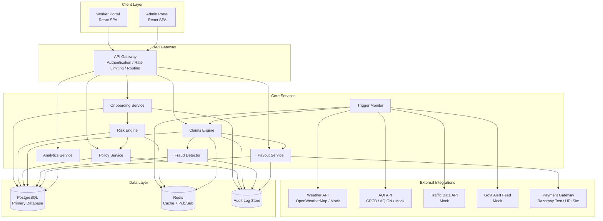
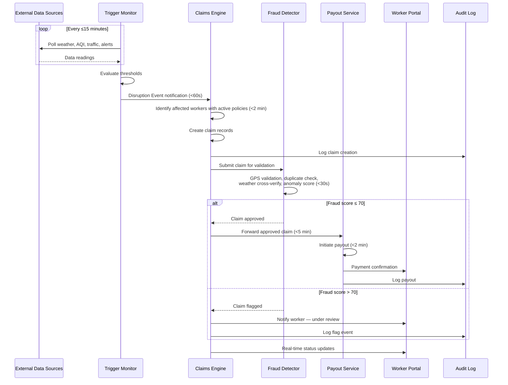
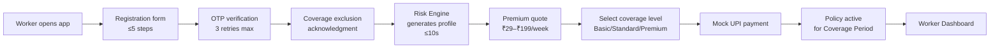
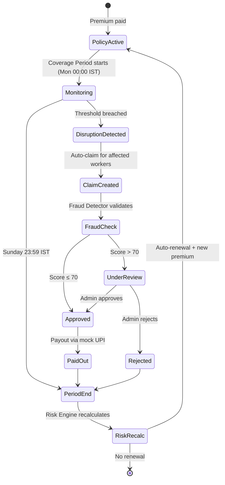
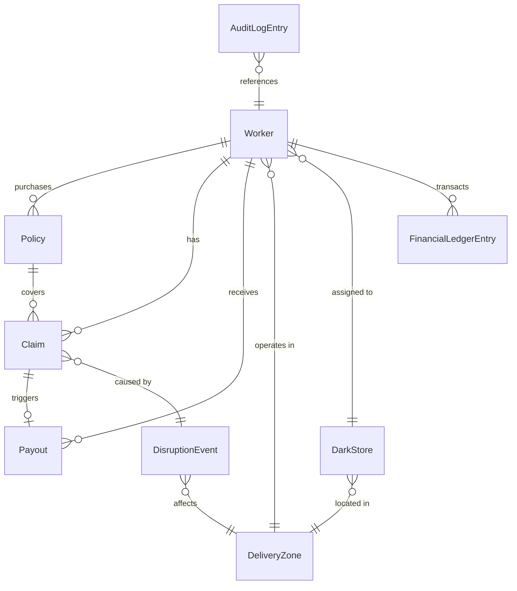

# Design Document: GigShield — Gig Worker Parametric Insurance

## Overview

GigShield is a web-based parametric insurance platform that provides automated income-loss protection for Q-Commerce delivery partners (Blinkit, Zepto) in India. The system monitors external environmental and social data sources in real time, automatically triggers claims when predefined thresholds are breached, runs AI-powered fraud detection, and disburses instant payouts — all without manual intervention from the worker.

The platform operates on weekly coverage cycles aligned with gig worker payout schedules. Premiums are dynamically calculated using an AI risk engine that incorporates hyperlocal disruption data. Coverage is strictly limited to income loss from environmental and social disruptions (extreme heat, heavy rainfall, flooding, severe pollution, curfews/strikes).

Key design goals:
- Zero-touch claims: workers never file a claim manually
- Sub-minute trigger-to-claim latency
- Weekly premium cycles affordable for gig workers (₹29–₹199)
- Fraud-resilient with GPS spoofing detection and multi-source weather verification
- Mock payment gateway integration (Razorpay test mode / UPI simulator)
- Full audit trail for regulatory transparency

## Architecture

### High-Level System Architecture



### Service Interaction Flow — Claim Lifecycle



### Worker Onboarding & Policy Purchase Flow



### Weekly Lifecycle




## Components and Interfaces

### 1. Onboarding Service

Handles worker registration, OTP verification, and profile creation.

| Endpoint | Method | Description |
|---|---|---|
| `/api/onboarding/register` | POST | Submit registration form (name, mobile, platform, dark store, zone, weekly deliveries) |
| `/api/onboarding/verify-otp` | POST | Verify OTP (mobile, otp). Max 3 retries. |
| `/api/onboarding/acknowledge-exclusions` | POST | Record worker's acknowledgment of coverage exclusions |

**Internal interfaces:**
- Calls `Risk_Engine.generateInitialProfile(workerId)` after successful onboarding
- Writes to Audit Log on profile creation

### 2. Risk Engine

AI/ML module for dynamic risk profiling and premium input.

| Endpoint | Method | Description |
|---|---|---|
| `/api/risk/profile/{workerId}` | GET | Get current risk profile |
| `/api/risk/recalculate/{workerId}` | POST | Trigger risk recalculation for new coverage period |

**Internal interfaces:**
- Reads historical disruption data, weather patterns (2 years), AQI trends, flood zone maps, strike/curfew frequency, traffic patterns for the worker's Delivery_Zone
- Reads 7-day forecast data from cached external API responses
- Outputs: `riskScore` (1–100), `riskTier` (Low/Medium/High/Critical)
- Called by Policy_Service for premium calculation

### 3. Policy Service

Manages policy lifecycle: creation, renewal, cancellation.

| Endpoint | Method | Description |
|---|---|---|
| `/api/policies/create` | POST | Create policy (workerId, coverageLevel). Triggers mock payment. |
| `/api/policies/{policyId}` | GET | Get policy details |
| `/api/policies/{workerId}/history` | GET | Get worker's policy history |
| `/api/policies/{policyId}/auto-renew` | PUT | Enable/disable auto-renewal |

**Internal interfaces:**
- Calls `Risk_Engine` for risk score → calculates premium
- Calls `Payment Gateway` for premium collection
- Emits policy state changes to Audit Log
- Schedules auto-renewal job at Coverage_Period boundary

**Premium calculation logic:**
```
weeklyPremium = baseRate × riskAdjustmentFactor × coverageLevelMultiplier
```
Where:
- `baseRate` is derived from zone-level historical loss data
- `riskAdjustmentFactor` maps from risk score (1–100) to a multiplier (0.5–2.5)
- `coverageLevelMultiplier`: Basic=0.7, Standard=1.0, Premium=1.4
- Final premium clamped to ₹29–₹199

### 4. Trigger Monitor

Polls external data sources and creates Disruption Events.

| Internal Interface | Description |
|---|---|
| `pollDataSources()` | Scheduled job, runs every ≤15 minutes |
| `evaluateThresholds(zoneId, readings)` | Checks readings against parametric trigger thresholds |
| `createDisruptionEvent(event)` | Persists event and notifies Claims Engine within 60s |

**Parametric trigger thresholds:**

| Event Type | Threshold | Source |
|---|---|---|
| Extreme Heat | Temperature > 45°C | Weather API |
| Heavy Rainfall | Rainfall > 65mm/hr | Weather API |
| Flooding | Flood alert issued | Weather API / IMD |
| Severe Pollution | AQI > 400 | AQI API |
| Social Disruption | Curfew/strike/zone closure | Govt Alert Feed |

**Failover:** If a data source is unavailable, the monitor switches to backup sources and uses cached data (up to 30 min stale). Outages are logged and surfaced to Admin Portal.

### 5. Claims Engine

Automated zero-touch claims processing.

| Endpoint | Method | Description |
|---|---|---|
| `/api/claims/{claimId}` | GET | Get claim details |
| `/api/claims/worker/{workerId}` | GET | Get worker's claims list |

**Internal interfaces:**
- Receives Disruption Event from Trigger Monitor
- Queries active policies for affected Delivery_Zone (< 2 min)
- Creates claim records with payout calculation
- Submits to Fraud Detector for validation
- On approval: forwards to Payout Service (< 5 min)
- On flag: routes to Admin review queue
- Emits real-time status updates to Worker Portal (created → validating → approved/under_review → paid)
- Rejects claims referencing excluded causes (health, accident, vehicle)

**Payout calculation:**
```
incomeLossPayout = disruptionHours × estimatedHourlyEarnings × coverageLevelPct
```
Where:
- `estimatedHourlyEarnings = (avgWeeklyDeliveries × perDeliveryEarnings) / workingHoursPerWeek`
- `coverageLevelPct`: Basic=0.40, Standard=0.60, Premium=0.80

### 6. Fraud Detector

AI-powered fraud detection with GPS spoofing detection.

| Internal Interface | Description |
|---|---|
| `validateClaim(claim)` | Runs all fraud checks within 30 seconds |

**Fraud checks performed:**
1. **GPS validation** — Worker's last known location within/near affected Delivery_Zone
2. **Duplicate detection** — Same worker + event type + coverage period = reject
3. **Weather cross-verification** — Event data confirmed by ≥2 independent sources
4. **Anomaly scoring** — ML-based score 0–100
5. **GPS spoofing detection** — Flags impossible travel (>10 km in 5 min), location jumps, coordinates outside registered zone
6. **Historical weather comparison** — Claimed conditions vs. recorded data from multiple sources

**Output:** `fraudScore` (0–100). Score > 70 → flagged for manual review with detailed anomaly explanation.

### 7. Payout Service

Processes instant payouts via mock payment gateway.

| Endpoint | Method | Description |
|---|---|---|
| `/api/payouts/{payoutId}` | GET | Get payout details |
| `/api/payouts/worker/{workerId}` | GET | Get worker's payout history |

**Internal interfaces:**
- Receives approved claim from Claims Engine
- Initiates payout within 2 minutes via mock Razorpay/UPI
- Retry logic: 3 attempts with exponential backoff (2 min, 4 min, 8 min)
- Maintains transaction ledger (claim ID, worker ID, amount, method, status, timestamp)
- Emits confirmation notification to Worker Portal

### 8. Analytics Service

Provides dashboards for workers and admins.

| Endpoint | Method | Description |
|---|---|---|
| `/api/analytics/worker/{workerId}/summary` | GET | Worker weekly summary |
| `/api/analytics/admin/overview` | GET | Admin real-time overview |
| `/api/analytics/admin/predictions` | GET | 7-day disruption forecast |
| `/api/analytics/admin/fraud` | GET | Fraud analytics |
| `/api/analytics/admin/zones/{zoneId}` | GET | Zone-level analytics |
| `/api/analytics/admin/loss-ratio` | GET | Loss ratio trends (12 periods) |

### 9. External Data Integration Layer

Abstraction layer over external APIs with caching and failover.

| Internal Interface | Description |
|---|---|
| `fetchWeatherData(zoneId)` | Returns temperature, rainfall, flood alerts |
| `fetchAQIData(zoneId)` | Returns AQI reading |
| `fetchTrafficData(zoneId)` | Returns traffic disruptions, road closures |
| `fetchSocialAlerts(zoneId)` | Returns curfew/strike/closure alerts |

**Caching strategy:** Redis cache with 30-minute TTL per data source per zone. On API error, serve cached data. Log all errors with API name, endpoint, error code, timestamp.

### 10. Payment Integration

Mock payment gateway adapter.

| Internal Interface | Description |
|---|---|
| `collectPremium(workerId, amount)` | Initiate UPI payment request, confirm within 30s |
| `disbursePayout(workerId, amount, claimId)` | Initiate payout via mock gateway |

**Financial ledger:** Records all transactions with worker ID, amount, direction (inflow/outflow), timestamp, transaction reference.


## Data Models

### Worker Profile

```
Worker {
  id: UUID (PK)
  name: string
  mobileNumber: string (unique, indexed)
  qCommercePlatform: enum [BLINKIT, ZEPTO]
  darkStoreId: UUID (FK → DarkStore)
  deliveryZoneId: UUID (FK → DeliveryZone)
  avgWeeklyDeliveryCount: integer
  riskScore: integer (1–100)
  riskTier: enum [LOW, MEDIUM, HIGH, CRITICAL]
  otpRetryCount: integer (default 0)
  exclusionsAcknowledged: boolean
  isVerified: boolean
  paymentMethodUPI: string
  createdAt: timestamp
  updatedAt: timestamp
}
```

### Delivery Zone

```
DeliveryZone {
  id: UUID (PK)
  pinCode: string (indexed)
  name: string
  geoBoundary: GeoJSON polygon
  city: string
  state: string
  createdAt: timestamp
}
```

### Dark Store

```
DarkStore {
  id: UUID (PK)
  name: string
  deliveryZoneId: UUID (FK → DeliveryZone)
  location: GeoPoint (lat, lng)
  platform: enum [BLINKIT, ZEPTO]
  createdAt: timestamp
}
```

### Policy

```
Policy {
  id: UUID (PK)
  workerId: UUID (FK → Worker, indexed)
  coverageLevel: enum [BASIC, STANDARD, PREMIUM]
  coveragePeriodStart: timestamp (Monday 00:00 IST)
  coveragePeriodEnd: timestamp (Sunday 23:59 IST)
  weeklyPremium: decimal (₹29–₹199)
  premiumBreakdown: JSON {
    baseRate: decimal,
    riskAdjustmentFactor: decimal,
    coverageLevelMultiplier: decimal
  }
  status: enum [PENDING_PAYMENT, ACTIVE, EXPIRED, CANCELLED]
  autoRenew: boolean (default true)
  paymentTransactionRef: string
  createdAt: timestamp
  updatedAt: timestamp
}
```

### Disruption Event

```
DisruptionEvent {
  id: UUID (PK)
  eventType: enum [EXTREME_HEAT, HEAVY_RAINFALL, FLOODING, SEVERE_POLLUTION, SOCIAL_DISRUPTION]
  severityLevel: enum [MODERATE, SEVERE, EXTREME]
  affectedDeliveryZoneId: UUID (FK → DeliveryZone, indexed)
  affectedDarkStoreIds: UUID[] (FK → DarkStore)
  timestamp: timestamp
  durationEstimateHours: decimal
  sourceDataReference: JSON { sourceApi: string, rawReading: any, threshold: any }
  verifiedBySources: string[] (min 2 for cross-verification)
  createdAt: timestamp
}
```

### Claim

```
Claim {
  id: UUID (PK)
  policyId: UUID (FK → Policy, indexed)
  workerId: UUID (FK → Worker, indexed)
  disruptionEventId: UUID (FK → DisruptionEvent, indexed)
  status: enum [CREATED, VALIDATING, APPROVED, UNDER_REVIEW, REJECTED, PAID]
  disruptionHours: decimal
  estimatedHourlyEarnings: decimal
  coverageLevelPct: decimal (0.40 | 0.60 | 0.80)
  incomeLossPayout: decimal
  fraudScore: integer (0–100)
  fraudCheckDetails: JSON {
    gpsValid: boolean,
    duplicateCheck: boolean,
    weatherCrossVerified: boolean,
    anomalyScore: integer,
    gpsSpoofingDetected: boolean,
    flaggedAnomalies: string[]
  }
  rejectionReason: string (nullable)
  createdAt: timestamp
  updatedAt: timestamp
}
```

### Payout

```
Payout {
  id: UUID (PK)
  claimId: UUID (FK → Claim, unique, indexed)
  workerId: UUID (FK → Worker, indexed)
  amount: decimal
  paymentMethod: string (e.g., "UPI_MOCK")
  transactionRef: string
  status: enum [INITIATED, SUCCESS, FAILED, RETRYING]
  retryCount: integer (max 3)
  createdAt: timestamp
  updatedAt: timestamp
}
```

### Financial Ledger Entry

```
FinancialLedgerEntry {
  id: UUID (PK)
  workerId: UUID (FK → Worker, indexed)
  amount: decimal
  direction: enum [INFLOW, OUTFLOW]
  type: enum [PREMIUM_PAYMENT, PAYOUT_DISBURSEMENT]
  referenceId: string (policy ID or claim ID)
  transactionRef: string
  timestamp: timestamp
}
```

### Audit Log Entry

```
AuditLogEntry {
  id: UUID (PK)
  entityType: enum [POLICY, CLAIM, PAYOUT, WORKER_PROFILE]
  entityId: UUID (indexed)
  previousState: string
  newState: string
  triggeringEvent: string
  timestamp: timestamp (indexed)
  metadata: JSON (optional additional context)
}
```

### External API Cache Entry

```
ExternalAPICache {
  id: UUID (PK)
  apiSource: enum [WEATHER, AQI, TRAFFIC, SOCIAL_ALERT]
  deliveryZoneId: UUID (FK → DeliveryZone)
  responseData: JSON
  fetchedAt: timestamp
  ttlMinutes: integer (default 30)
}
```

### Entity Relationship Diagram




## Correctness Properties

*A property is a characteristic or behavior that should hold true across all valid executions of a system — essentially, a formal statement about what the system should do. Properties serve as the bridge between human-readable specifications and machine-verifiable correctness guarantees.*

### Property 1: Valid registration triggers OTP dispatch

*For any* valid registration form (all required fields present: name, mobile, platform, dark store, zone, weekly deliveries), submitting the form should result in an OTP being dispatched to the provided mobile number.

**Validates: Requirements 1.2**

### Property 2: Valid OTP creates verified worker profile

*For any* pending registration with a valid OTP, verifying the OTP should produce a worker profile with `isVerified = true` and all registration fields persisted correctly.

**Validates: Requirements 1.3**

### Property 3: Invalid OTP rejection with retry tracking

*For any* OTP verification attempt with an invalid or expired OTP, the system should reject the attempt, increment the retry counter, and allow further attempts only if the retry count is below 3.

**Validates: Requirements 1.4**

### Property 4: Registration form validation rejects incomplete submissions

*For any* registration form with at least one required field missing, the system should reject the submission and return validation errors identifying exactly the missing fields.

**Validates: Requirements 1.5**

### Property 5: Risk score invariant and tier classification

*For any* worker with valid delivery zone data, the Risk Engine should produce a risk score in the range [1, 100], and the risk tier should be correctly classified as: Low (1–25), Medium (26–50), High (51–75), or Critical (76–100).

**Validates: Requirements 2.3, 2.5**

### Property 6: Premium calculation produces valid result with consistent breakdown

*For any* combination of risk score (1–100), average weekly earnings, and coverage level (Basic/Standard/Premium), the calculated weekly premium should be within ₹29–₹199, and the premium breakdown components (baseRate × riskAdjustmentFactor × coverageLevelMultiplier) should equal the final premium (before clamping).

**Validates: Requirements 3.1, 3.3, 3.5**

### Property 7: Policy creation yields unique IDs

*For any* valid policy purchase request (valid worker, coverage level, and successful payment), the Policy Service should create a policy with a unique ID, and no two policies should share the same ID.

**Validates: Requirements 4.1**

### Property 8: Auto-renewal creates new policy if and only if enabled

*For any* policy at the end of a Coverage Period, a new policy for the next period is created if and only if auto-renewal is enabled. When disabled, the current period completes with no successor policy.

**Validates: Requirements 4.3, 4.4**

### Property 9: Policy history completeness

*For any* worker with N policy operations (create, renew, cancel), the policy history should contain exactly N entries, each with correct status and timestamps.

**Validates: Requirements 4.6**

### Property 10: Threshold evaluation produces correct disruption events

*For any* set of external data readings for a delivery zone, the Trigger Monitor should create a DisruptionEvent record (with event type, severity, affected zone, dark store references, timestamp, duration estimate, and source reference) if and only if at least one reading crosses its predefined threshold (temp > 45°C, rainfall > 65mm/hr, flood alert, AQI > 400, or social disruption alert).

**Validates: Requirements 5.2, 5.3**

### Property 11: Disruption event triggers claims for all affected workers

*For any* disruption event affecting a delivery zone, the Claims Engine should create exactly one claim record for each worker who has an active policy in that zone, and no claims for workers without active policies in that zone.

**Validates: Requirements 6.1, 6.2**

### Property 12: Income loss payout calculation

*For any* claim with disruption duration (hours), estimated hourly earnings, and coverage level percentage, the payout should equal `disruptionHours × estimatedHourlyEarnings × coverageLevelPct`, where `estimatedHourlyEarnings = (avgWeeklyDeliveries × perDeliveryEarnings) / workingHoursPerWeek`.

**Validates: Requirements 6.3**

### Property 13: Claim routing based on fraud score

*For any* claim submitted for validation, the claim is routed to the Payout Service if the fraud score is ≤ 70, or placed in the admin review queue if the fraud score is > 70. Every claim must pass through fraud detection before any routing decision.

**Validates: Requirements 6.4, 6.5, 6.6**

### Property 14: Claim state transition notifications

*For any* claim state transition (created → validating → approved/under_review → paid), a status update notification should be emitted to the worker.

**Validates: Requirements 6.7**

### Property 15: GPS validation and spoofing detection

*For any* claim and associated worker GPS data, the Fraud Detector should flag the claim if the worker's location is outside the affected delivery zone, OR if the GPS trace shows impossible travel (speed exceeding 10 km in 5 minutes), OR if coordinates fall outside the registered delivery zone.

**Validates: Requirements 7.2, 7.7**

### Property 16: Duplicate claim detection and rejection

*For any* set of claims, if two claims share the same worker ID, disruption event type, and coverage period, the duplicate should be rejected.

**Validates: Requirements 7.3**

### Property 17: Multi-source disruption event verification

*For any* disruption event, the Fraud Detector should cross-verify the event data against at least two independent data sources, and flag claims where the claimed conditions do not match recorded historical data from those sources.

**Validates: Requirements 7.4, 7.8**

### Property 18: Fraud score invariant and flagging threshold

*For any* claim, the fraud score must be in the range [0, 100], and claims with a score above 70 must be flagged for manual review with a non-empty list of anomaly explanations.

**Validates: Requirements 7.5, 7.6**

### Property 19: Successful payout updates claim status and sends confirmation

*For any* successfully processed payout, the associated claim status should be updated to "paid", and a confirmation notification containing the payout amount and transaction reference should be sent to the worker.

**Validates: Requirements 8.3**

### Property 20: Payout retry with exponential backoff

*For any* failed payout transaction, the system should retry up to 3 times with intervals of 2, 4, and 8 minutes respectively. If all retries fail, the Admin Portal should be notified.

**Validates: Requirements 8.4**

### Property 21: Financial ledger completeness

*For any* financial transaction (premium payment or payout disbursement), a ledger entry should be created containing: worker ID, amount, direction (inflow/outflow), type, reference ID, transaction reference, and timestamp.

**Validates: Requirements 8.5, 12.4**

### Property 22: Worker disruption alert content

*For any* disruption event affecting a worker's delivery zone, the alert displayed to the worker should contain the event type, severity level, affected dark store, and expected impact duration.

**Validates: Requirements 9.2**

### Property 23: Worker weekly summary aggregation

*For any* set of claims, payouts, and premium payments within a coverage period for a worker, the weekly summary should correctly aggregate: number of disruption events, total disruption hours, total payout received, and premium paid.

**Validates: Requirements 9.3**

### Property 24: Worker claims list chronological ordering

*For any* set of claims for a worker, the claims list should be ordered chronologically and each entry should contain status, event type, payout amount, and processing timestamps.

**Validates: Requirements 9.5**

### Property 25: Admin overview metrics aggregation

*For any* set of platform data (policies, claims, payouts, premiums), the admin overview should correctly compute: total active policies, claims by status, aggregate payout amount, aggregate premium collected, and loss ratio (aggregate payout / aggregate premium).

**Validates: Requirements 10.1**

### Property 26: Admin fraud analytics aggregation

*For any* set of fraud detection results, the fraud analytics should correctly compute: total flagged claims, fraud detection rate, false positive rate, GPS spoofing attempts detected, and the pending review list should match claims with status UNDER_REVIEW.

**Validates: Requirements 10.3**

### Property 27: Zone-level analytics correctness

*For any* delivery zone and its associated data, the zone analytics should correctly compute: disruption frequency, average payout per worker, and risk distribution across workers in that zone.

**Validates: Requirements 10.5**

### Property 28: Loss ratio trend computation

*For any* set of coverage period data over 12 periods, the loss ratio for each period should equal (total payouts / total premiums) for that period, and filtering by zone or disruption type should only include matching records.

**Validates: Requirements 10.6**

### Property 29: External API error logging

*For any* external API call that returns an error response, a log entry should be created containing: API name, endpoint, error code, and timestamp.

**Validates: Requirements 11.5**

### Property 30: API response caching and fallback

*For any* successful external API response, the response should be cached. If the live source becomes unavailable within 30 minutes of the last successful fetch, the cached response should be returned instead.

**Validates: Requirements 11.6**

### Property 31: Payment confirmation activates policy

*For any* premium payment that receives a successful confirmation, the corresponding policy status should be updated to ACTIVE for the relevant coverage period.

**Validates: Requirements 12.2, 12.3**

### Property 32: Coverage exclusion enforcement

*For any* claim, it must be linked to a verified DisruptionEvent of type environmental or social. Claims referencing excluded causes (health conditions, bodily injury, accidents, vehicle damage, vehicle repair) should be rejected.

**Validates: Requirements 13.1, 13.3**

### Property 33: Audit log entry for every state change

*For any* state change in a policy, claim, or payout entity, an audit log entry should be created containing: entity ID, entity type, previous state, new state, timestamp, and triggering event.

**Validates: Requirements 14.2**

### Property 34: Audit log query filtering

*For any* set of audit log entries and filter criteria (entity type, date range, worker ID), the query results should contain exactly the entries matching all specified filters.

**Validates: Requirements 14.3**


## Error Handling

### External API Failures

| Scenario | Handling |
|---|---|
| Weather/AQI/Traffic API returns error | Log error (API name, endpoint, error code, timestamp). Serve cached response if available and ≤30 min old. Switch to backup source if configured. Alert Admin Portal if all sources fail. |
| External API timeout | Treat as error. Apply same caching/fallback strategy. |
| All external sources unavailable for a zone | Trigger Monitor pauses threshold evaluation for that zone. Admin Portal receives critical alert. No false disruption events created. |

### Payment Failures

| Scenario | Handling |
|---|---|
| Premium payment fails | Retry once after 4 hours. Notify worker of failure. Policy remains in PENDING_PAYMENT status. |
| Payout disbursement fails | Retry up to 3 times with exponential backoff (2, 4, 8 min). If all retries fail, notify Admin Portal. Claim status remains APPROVED (not PAID). |
| Mock gateway unavailable | Queue transaction for retry. Log outage. |

### Onboarding Errors

| Scenario | Handling |
|---|---|
| Invalid/expired OTP | Return error message. Allow up to 3 retries. After 3 failures, require new OTP generation. |
| Missing registration fields | Return field-level validation errors. Do not create partial profiles. |
| Duplicate mobile number | Return error indicating account already exists. |

### Claims Processing Errors

| Scenario | Handling |
|---|---|
| Claim references excluded cause | Reject claim immediately with reason. Log rejection in audit trail. |
| Claim not linked to verified disruption event | Reject claim. No payout initiated. |
| Fraud Detector unavailable | Queue claim for validation. Do not auto-approve. Alert Admin Portal. |
| Duplicate claim detected | Reject duplicate. Keep original claim intact. |

### Data Integrity

| Scenario | Handling |
|---|---|
| Database write failure | Retry with backoff. If persistent, alert Admin Portal. No partial state changes — use transactions. |
| Audit log write failure | Retry. If persistent, halt the triggering operation (fail-safe) to maintain audit completeness. |
| Inconsistent state detected | Log anomaly. Flag for admin review. Do not auto-correct. |

## Testing Strategy

### Unit Testing

Unit tests cover specific examples, edge cases, and error conditions. Use a standard testing framework (e.g., Jest for TypeScript/JavaScript, pytest for Python).

Focus areas:
- **Onboarding:** Valid/invalid form submissions, OTP verification success/failure, retry limit enforcement, exclusion acknowledgment flow
- **Risk Engine:** Tier boundary values (scores 1, 25, 26, 50, 51, 75, 76, 100), edge cases for missing zone data
- **Premium Calculation:** Boundary premiums (₹29 and ₹199 clamping), each coverage level multiplier, zero/negative earnings edge case
- **Threshold Evaluation:** Each trigger type at exactly the threshold value, just below, and just above
- **Claims Engine:** Claim creation with no active policies in zone, excluded cause rejection, claim with missing disruption event
- **Fraud Detector:** GPS coordinates exactly on zone boundary, duplicate claim with slight timestamp difference, spoofing with exactly 10 km in 5 min
- **Payout:** Successful payout flow, all-retries-exhausted flow, ledger entry verification
- **Analytics:** Empty data sets, single-period loss ratio, zone with no workers
- **Audit Log:** Filter with no matches, filter with all matches, date range boundary

### Property-Based Testing

Property-based tests verify universal properties across randomly generated inputs. Use a PBT library appropriate for the target language:
- **JavaScript/TypeScript:** `fast-check`
- **Python:** `hypothesis`
- **Java:** `jqwik`

Each property test must:
- Run a minimum of 100 iterations
- Reference the design document property with a tag comment in the format: `Feature: gig-worker-parametric-insurance, Property {number}: {title}`
- Be implemented as a single property-based test per correctness property

Properties to implement as PBT:

| Property | Test Description |
|---|---|
| 1: Valid registration triggers OTP | Generate random valid forms → verify OTP dispatch |
| 2: Valid OTP creates profile | Generate random valid OTPs → verify profile creation |
| 3: Invalid OTP rejection | Generate random invalid OTPs → verify rejection and retry tracking |
| 4: Form validation | Generate forms with random missing fields → verify correct error identification |
| 5: Risk score and tier | Generate random zone data → verify score ∈ [1,100] and tier mapping |
| 6: Premium calculation | Generate random (score, earnings, level) → verify ₹29–199 range and breakdown consistency |
| 7: Unique policy IDs | Generate multiple policy requests → verify all IDs unique |
| 8: Auto-renewal logic | Generate policies with random auto-renew flag → verify correct renewal behavior |
| 9: Policy history | Generate random policy operation sequences → verify history completeness |
| 10: Threshold evaluation | Generate random readings → verify correct event creation |
| 11: Affected worker claims | Generate random zones, workers, policies, events → verify correct claim creation |
| 12: Payout calculation | Generate random (hours, earnings, level) → verify formula |
| 13: Claim routing | Generate claims with random fraud scores → verify correct routing |
| 14: State transition notifications | Generate random state transitions → verify notification emission |
| 15: GPS validation | Generate random GPS traces → verify correct flagging |
| 16: Duplicate detection | Generate claim sets with duplicates → verify rejection |
| 17: Multi-source verification | Generate events with varying source agreement → verify cross-check |
| 18: Fraud score invariant | Generate random claims → verify score range and flagging |
| 19: Payout confirmation | Generate random successful payouts → verify status update and notification |
| 20: Retry backoff | Generate failed payouts → verify retry schedule |
| 21: Ledger completeness | Generate random transactions → verify ledger entries |
| 22: Alert content | Generate random disruption events → verify alert fields |
| 23: Weekly summary | Generate random weekly data → verify aggregation |
| 24: Claims ordering | Generate random claim sets → verify chronological order |
| 25: Admin overview | Generate random platform data → verify metric aggregation |
| 26: Fraud analytics | Generate random fraud results → verify analytics computation |
| 27: Zone analytics | Generate random zone data → verify computation |
| 28: Loss ratio trends | Generate random period data → verify ratio computation and filtering |
| 29: API error logging | Generate random API errors → verify log entries |
| 30: Cache fallback | Generate API responses then simulate failures → verify cached data returned |
| 31: Payment activates policy | Generate random payment confirmations → verify policy activation |
| 32: Exclusion enforcement | Generate claims with random causes → verify rejection of excluded causes |
| 33: Audit log entries | Generate random state changes → verify audit log creation |
| 34: Audit log filtering | Generate random log entries and filters → verify correct filtering |

### Integration Testing

Integration tests verify the end-to-end flows across service boundaries:
- **Onboarding → Risk Engine → Policy Service:** Complete worker registration through first policy purchase
- **Trigger Monitor → Claims Engine → Fraud Detector → Payout Service:** Full claim lifecycle from disruption detection to payout
- **External API integration:** Mock API responses, failover behavior, cache expiry
- **Payment flow:** Premium collection → policy activation, payout → claim status update

